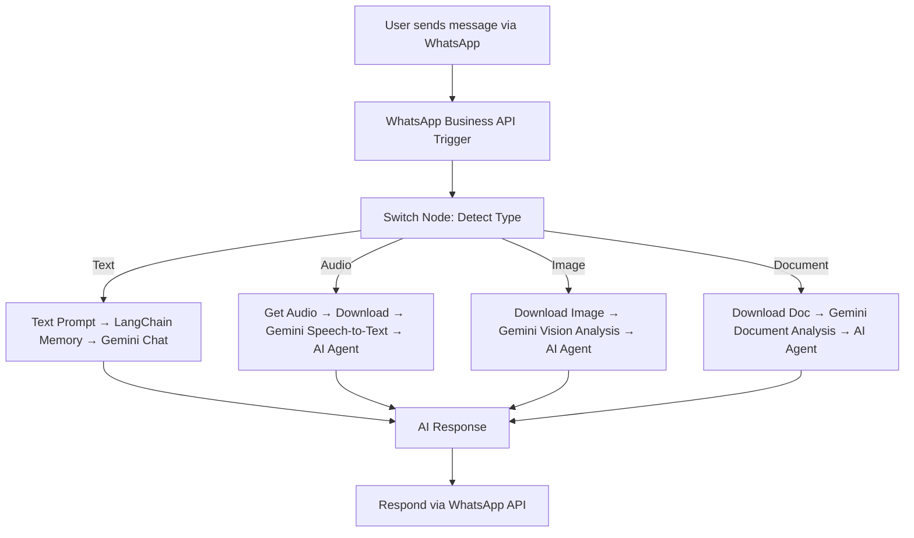

# 🌐 AI-Powered Multi-Modal Conversational Agent

> An **end-to-end AI automation system** that enables **real-time, context-aware conversations over WhatsApp**, powered by **LangChain, Google Gemini, and n8n**.

## 📖 Overview

This project is a **multi-modal digital assistant** that allows users to interact with AI through **their most familiar platform — WhatsApp**. Designed with inclusivity in mind, it caters especially to **Tier 2/Tier 3 communities, farmers, and differently-abled users**, providing them with a **powerful digital tool** for daily problem-solving.

Users can:

* 💬 **Send text queries** and get intelligent answers.
* 🎙️ **Send voice messages** → transcribed & analyzed.
* 🖼️ **Share images** → described & explained by AI.
* 📄 **Upload documents** → parsed & summarized.
* 📲 Receive **instant AI-driven responses** directly on WhatsApp.

---

## ✨ Key Features

* **Multi-Modal Input Support:** Handles text, audio, images, and documents.
* **Conversational Memory:** Context-aware chat experience powered by **LangChain Memory**.
* **Real-Time Automation:** Orchestrated with **n8n workflows**.
* **AI-Powered Intelligence:** Uses **Google Gemini APIs** for NLP, Vision, and Document AI.
* **Accessibility-Oriented:** Designed for users with limited digital literacy.
* **Scalable Use Cases:** Agriculture (Farm Sakhi), accessibility tools, education, customer support, and more.

---

## 🛠️ Tech Stack

**Workflow Automation:** n8n
**AI & LLMs:** LangChain, Google Gemini (PaLM API)
**NLP & Speech:** Gemini Speech-to-Text, Conversational Memory
**Computer Vision:** Image Analysis with Gemini Vision API
**Document AI:** Parsing, analysis & summarization
**Messaging Integration:** WhatsApp Business API
**Backend Utilities:** Node.js, REST APIs, Webhooks

---

## 🔄 System Architecture



---

## 🚀 Getting Started

### 1️⃣ Prerequisites

* [n8n](https://n8n.io/) installed locally or on cloud.
* WhatsApp Business API account.
* Google Gemini API credentials.
* Node.js (for local workflow testing).

### 2️⃣ Setup Instructions

1. Clone this repository:

   ```bash
   git clone https://github.com/yourusername/multimodal-whatsapp-agent.git
   cd multimodal-whatsapp-agent
   ```
2. Import the provided n8n workflow JSON (`workflow.json`) into your n8n instance.
3. Configure credentials:

   * WhatsApp Business API
   * Google Gemini (PaLM API key)
   * HTTP/Webhook Auth
4. Activate the workflow.

---

## 📂 Project Structure

```
├── workflow.json          # n8n workflow definition
├── README.md              # Project documentation
├── docs/                  # Architecture diagrams, use case docs
└── examples/              # Sample inputs (text, audio, image, docs)
```

---

## 🌍 Use Cases

* **Farm Sakhi (Agriculture):** Farmers can send crop images, ask questions, and receive AI-powered advice in local languages.
* **Accessibility:** Differently-abled users can rely on **voice-based queries** and get instant assistance.
* **Education:** Students can upload PDFs or notes for AI-powered summaries and clarifications.
* **Customer Support:** Businesses can automate FAQs, query resolution, and document verification.

---

## 📊 Impact

* **Democratizes digital access** for underserved communities.
* **Bridges the gap** between AI advancements and grassroots users.
* **Scalable across domains** — agriculture, education, healthcare, support.

---

## 🚧 Future Enhancements

* 📹 **Video Analysis Support** (frame extraction + context).
* 🌐 **Multilingual Support** for regional Indian languages.
* ☁️ **Cloud Deployment** for large-scale adoption.
* 🔗 **Integration with other platforms** (Telegram, Messenger, SMS).

---

## 🙌 Acknowledgments

* [n8n](https://n8n.io/) – Workflow automation platform.
* [LangChain](https://www.langchain.com/) – LLM orchestration.
* [Google Gemini](https://deepmind.google/technologies/gemini/) – AI APIs powering NLP, Vision, and Document AI.

---

⚡ With this README, your project looks **enterprise-level, polished, and portfolio-ready**.

👉 Do you also want me to prepare a **short GitHub tagline/description (one-liner under repo name)** that instantly grabs attention?
